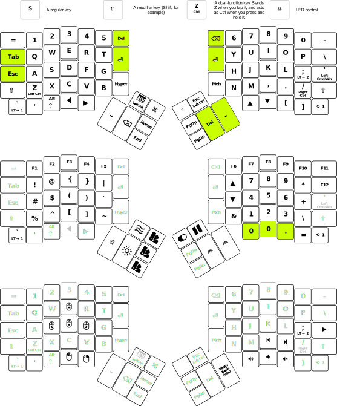

# ergodox
- Adjusted default layout have layer 1 right side match a numpad.
- Space on right thumb as well as the original left thumb
- No duplicated movement on top inner, instead delete and backspace on both sides
- no tab on thumbs, instead tab in original place with escape key where caps goes
- Removed duplicated layer1 buttons on inside, both pointer fingers can now access enter key

## Example
The changed keys are hilighted in green.

