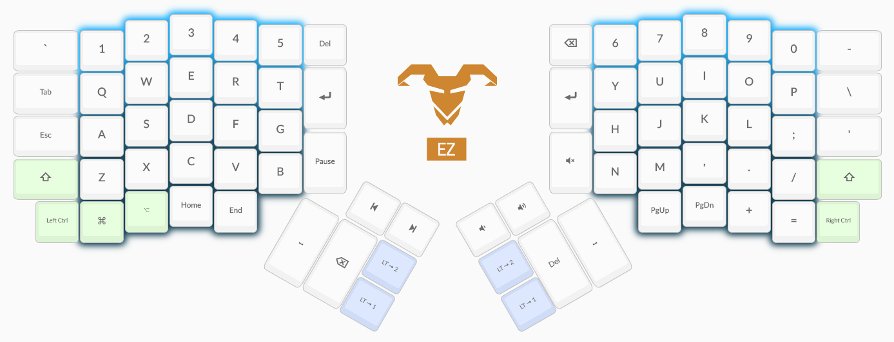

# ergodox
The purpose of altering the default ergodox configuration is to have the keyboard mostly resemble standard qwerty layouts while building upon that foundation with a few priorities I have:

- The spacebar must be easily used by both hands.
- Arrow keys should match vim layout `hjkl` to have greater parity with development movement
- A numpad layer should exist to now only allow quick number adding, but supplement ergodox missing keys such as +/=
- Media keys such as volume and playback control should be easily accessible.
- Where possible common used programming keys should be close to home row.

## Example

